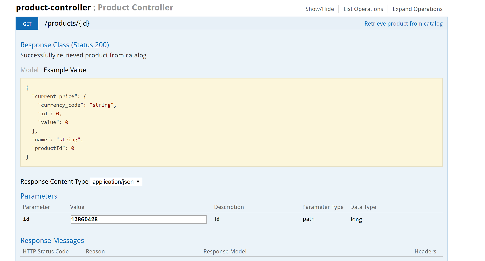
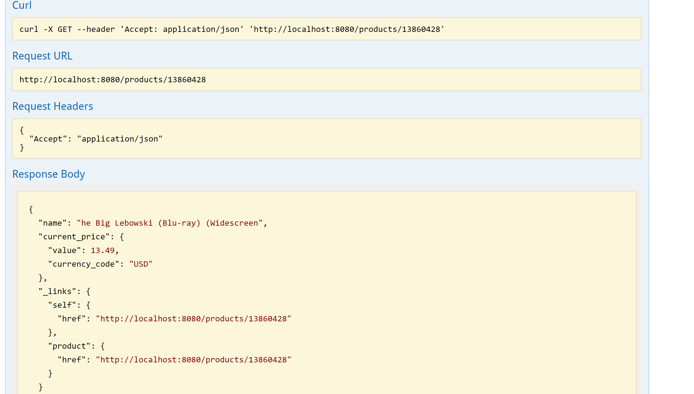
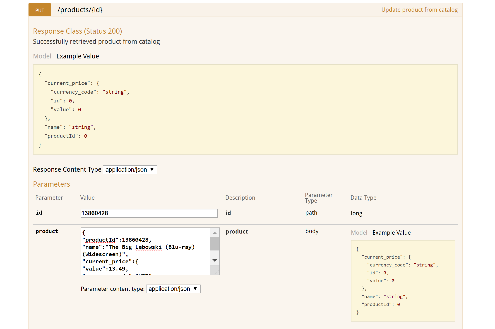
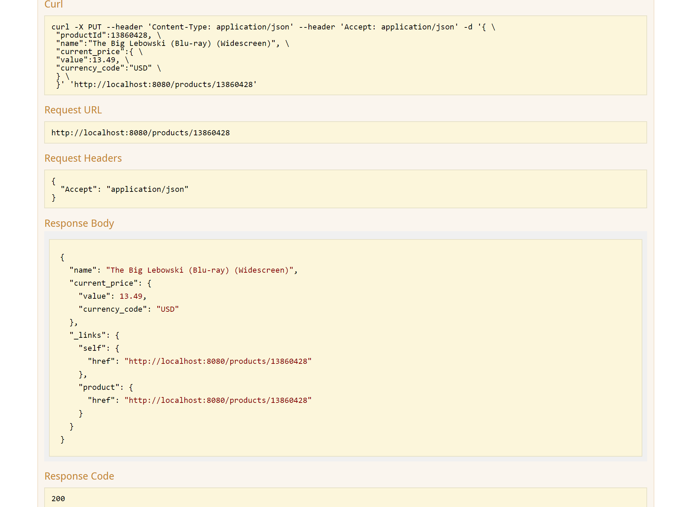
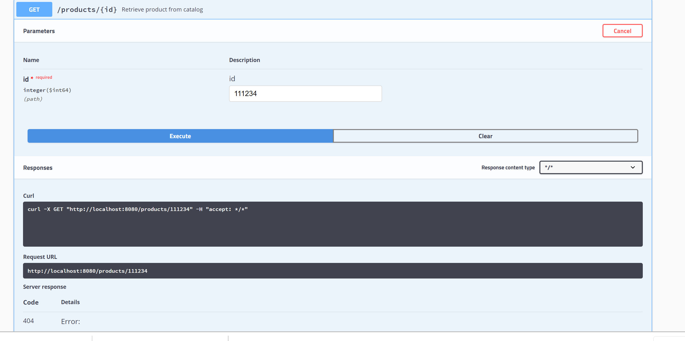
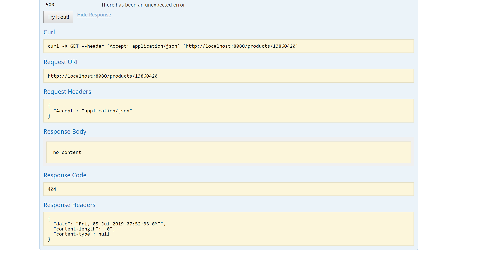
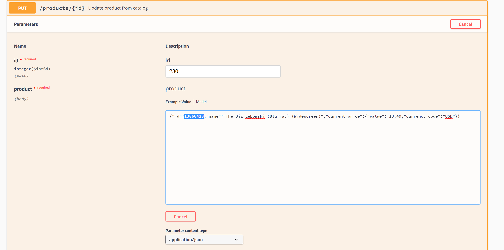

Case Study:
***********************************************************

myRetail is a rapidly growing company with HQ in Richmond, VA and over 200 stores across the east coast. myRetail wants to make its internal data available to any number of client devices, from myRetail.com to native mobile apps.

The goal for this exercise is to create an end-to-end Proof-of-Concept for a products API, which will aggregate product data from multiple sources and return it as JSON to the caller. Your goal is to create a RESTful service that can retrieve product and price details by ID. The URL structure is up to you to define, but try to follow some sort of logical convention.

Build an application that performs the following actions:

Responds to an HTTP GET request at /products/{id} and delivers product data as JSON (where {id} will be a number. Example product IDs: 15117729, 16483589, 16696652, 16752456, 15643793) 
Example response: 

```
{"id":13860428,"name":"The Big Lebowski (Blu-ray) (Widescreen)","current_price":{"value": 13.49,"currency_code":"USD"}} 
```
Performs an HTTP GET to retrieve the product name from an external API. (For this exercise the data will come from redsky.target.com, but let’s just pretend this is an internal resource hosted by myRetail) 


Example: http://redsky.target.com/v2/pdp/tcin/13860428?excludes=taxonomy,price,promotion,bulk_ship,rating_and_review_reviews,rating_and_review_statistics,question_answer_statistics

Reads pricing information from a NoSQL data store and combines it with the product id and name from the HTTP request into a single response.

BONUS: Accepts an HTTP PUT request at the same path (/products/{id}), containing a JSON request body similar to the GET response, and updates the product’s price in the data store.

Service Flow:
*********************************************************************************


Technology Stack:
************************************************************************************

1	Java	1.8

2	Spring Boot	2.1.6	https://projects.spring.io/spring-boot/

3	Mongo DB	https://www.mongodb.com/

4	Gradle	https://gradle.org

4	Swagger 2.9.2	http://swagger.io/

5	Mockito	http://site.mockito.org/

Setup instructions:
*****************************************************************************

Install Java 1.8

Download STS 3.9.9 : https://spring.io/tools3/sts/all

Install Mongo DB: https://docs.mongodb.com/manual/tutorial/install-mongodb-on-windows/

Github: Download project from the following git repository https://github.com/prachik468/myRetail a) Download as a ZIP file OR

b) Clone the git project from git-bash or command prompt (You must have git setup)

Import the project into eclipse – File->import

Run the application:
*********************************

1)mongodb  should be running on :

Host: 127.0.0.1 Port: 27017

2)to Test the get request type the below URl in the Web Browser: 
	http://localhost:8080/products/{id}   where {id} is the productId

example: http://localhost:8080/products/13860428

To test Update: In Swagger: Send a PUT request to http://localhost:8080/products/{id}    where {id} is the productId

Example:- http://localhost:8080/products/13860428
````
{"id":13860428,"name":"The Big Lebowski (Blu-ray) (Widescreen)","current_price":{"value": 13.49,"currency_code":"USD"}} 
````

Swagger2 documentation path:
*******************************************

http://localhost:8080/swagger-ui.html

GET: With valid product (http://localhost:8080/products/13860428) 



PUT Request: With Valid product Id



GET: With invalid product (http://localhost:8080/products/13860428)



PUT Request: With invalid product Id:

